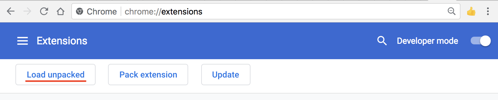
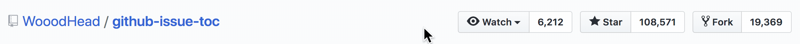

> # Find the answer faster 
:+1:


# Install

Install from Chrome Web Store

OR

Download the source code and load *app* folder in Chrome extensions page( chrome://extensions/ )



# Development

```bash
npm install
npm run start
```


# Use test-page for faster debugging

```bash
npm install -g serve
serve ./test-page

```

# Star this project


