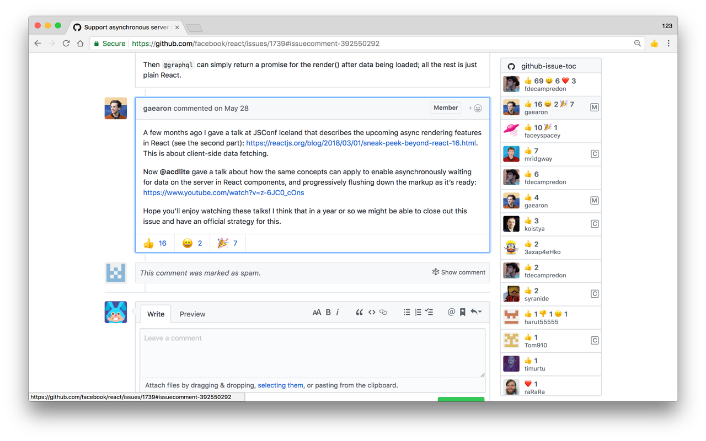

> # Find the answer faster :+1:




# Install

Install from [Chrome Web Store](https://chrome.google.com/webstore/detail/github-issue-toc/ilbogmmcemabaedfhhfiodlfcejmbnge)

OR

Download the source code and load *app* folder in Chrome extensions page( [chrome://extensions](chrome://extensions) )


# Development

```bash
npm install
npm run start
```


# Use test-page for faster debugging

```bash
npm install -g serve
serve ./test-page

```

# TODO
[ ] add support for firefox and other browsers

# Star this project


